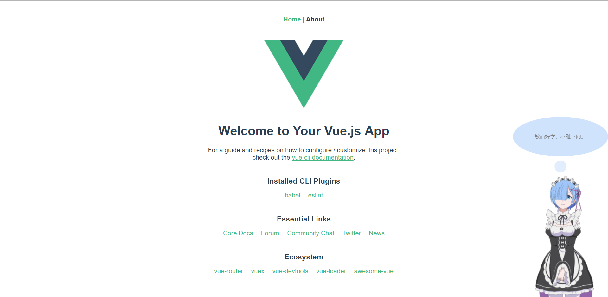

# live2d-vue 三步即食--食用指南


>本方法的live2d适合在**vue-cli3**中配置！！！ 
>
>网上找到的许多方法都在vue上栽了跟头，于是乎就自己做了一个(つд⊂)
>
>大部分预期功能仍未添加，就作为第一个小版本⑧
___
>#### 第一步：克隆代码，将public下的**live2d文件**和static路径下的**js文件**导入你的对应文件中    
___
>#### 第二步：将components下的**Live2d.vue组件**导入你的components中  
___
>#### 第三步：将组件引入展示页面内并设置相关内容，可参考相关代码或以下操作
___
```
//导入依赖

    npm install
    
    
//在main.js中引入

    import Live2d from './components/Live2d'
    
    Vue.use(Live2d);


//在Home.vue中引入

    <Live2d></Live2d>
    
    import Live2d from '@/components/Live2d'
    export default {
      name: 'home',
      components: {
        /*其他组件*/
        Live2d
      }
    } 

//在index.html中引入

    <script src="live2d/js/jquery.min.js"></script>

```
___
>OK啦，就是这么简单！ 接下来是各位大大个性化的阶段：
```

相关效果可自行修改，以下为可修改文件：

    animate.js —— 图片层动画效果设置
    
    message.js —— Live2d动画效果设置
    
    message.json —— 交互文字设置
    
    栗子酱： "mouseover": [
               {
                   "selector": ".className",  //元素标签名
                   "text": [""]  //提示文字
               }
    
    model —— 人物模型设置
    
    Live2d.vue —— 组件布局设置
    
```
___
### 现在就可以尝试运行你的程序，内含**小彩蛋**哟(≧∀≦)ゞ
```
npm run serve && npm run build
```
___

```
此为Live2d-vue的第一版雏形，以后会把它好好完善更多功能滴─=≡Σ((( つ•̀ω•́)つ
```

如果喜欢的话，不妨点个**star**再走咯(ゝ∀･)
